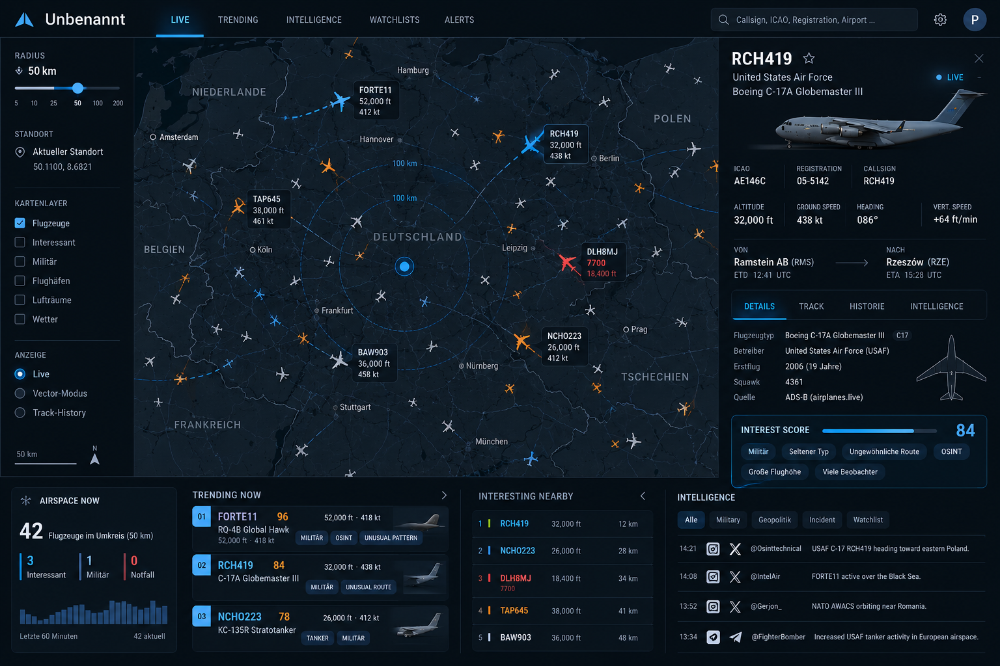

# VectorScope

Personal live aviation radar: what is flying above you right now.
Runs as a web app on GitHub Pages and installs on iPhone and iPad via "Add to Home Screen".



## Features

| View | What it does |
|---|---|
| **Radar** | Map around your location with range rings. Aircraft are grey by default; colour only means something: Ice Blue = interesting, Cobalt with ring = watchlist, Amber = event, Red = emergency. |
| **Overhead** | What is above you now and what will pass over you in the next 10 minutes: countdown, miss distance, compass direction and elevation angle to look at. |
| **Inspector** | Telemetry, route (where published), relative geometry, interest score with reasons, photo (planespotters.net). |
| **Notable now** | Military and emergency traffic in Europe, ranked by interest score. |
| **Interesting nearby** | Ranked list within your radius. |
| **Watchlist** | Callsign prefixes (FORTE, RCH, NATO), type codes (C17, B52), registrations, ICAO hex. In-app alert when a match enters your radius. |

"Overhead" is defined by elevation angle, not by a fixed radius (zenith ≥ 70°, overhead ≥ 45°, approaching when the closest point of approach within 10 minutes reaches ≥ 45°).

Units are metric with German number formatting (10.670 m, 889 km/h). Switch to ft/kt in Settings.

## Data sources

| Source | Use | Licence |
|---|---|---|
| [adsb.lol](https://adsb.lol) | Live positions, military list, route lookup | ODbL 1.0, attribution |
| [OpenFreeMap](https://openfreemap.org) | Vector basemap | OpenMapTiles / OSM |
| [planespotters.net](https://www.planespotters.net) | Aircraft photos | Photographer credit and link |

Personal, non-commercial use. No account, no tracking, no ads.

## Privacy

Location, watchlist and settings are stored only in the browser's localStorage on your device.
Requests to adsb.lol use coordinates rounded to about 1 km. Nothing personal is stored in this repository.

## Data access and the proxy

adsb.lol does not send CORS headers on its `/v2` endpoints, so browsers may block direct requests.
The app tries direct access first and falls back to a proxy if one is configured.

**Proxy setup (free, about 5 minutes):**

1. Sign in at [vercel.com](https://vercel.com) with GitHub, "Add New Project", import this repository.
2. Set **Root Directory** to `proxy`. Framework preset: Other. Deploy.
3. Optional environment variables: `ALLOWED_ORIGIN` = `https://michaeldobner.github.io`, `PROXY_TOKEN` = any secret string.
4. In the app: Settings, Data source, paste the Vercel URL (and the token).

The proxy only forwards a whitelist of read-only adsb.lol paths. Cloudflare Workers are not recommended: adsb.lol currently answers them with HTTP 429.

## Install on iPhone / iPad

Open the Pages URL in Safari, tap Share, "Add to Home Screen". The app starts full screen, supports portrait and landscape and respects notch and home indicator.
Set your location inside the installed app (Safari and the home screen app keep separate storage).

## Development

```bash
npm install
npm run dev        # local dev server
npm test           # geo and overhead unit tests
npm run build      # production build into dist/
```

Useful URL flags: `?demo` (synthetic traffic), `?lat=50.11&lon=8.68` (fixed location).

Pushing to `main` deploys to GitHub Pages via `.github/workflows/deploy.yml`.

## Structure

```
src/geo      distance, bearing, elevation, closest point of approach (tested)
src/data     adsb.lol client, demo traffic, classification catalogue, interest score
src/state    settings (localStorage), live traffic store, watchlist matching
src/map      MapLibre view, air-navigation basemap style, aircraft glyphs
src/ui       inspector, lists, settings, layout hooks, design tokens
proxy        optional Vercel CORS proxy
docs/design  design brief and target mock-up
```
