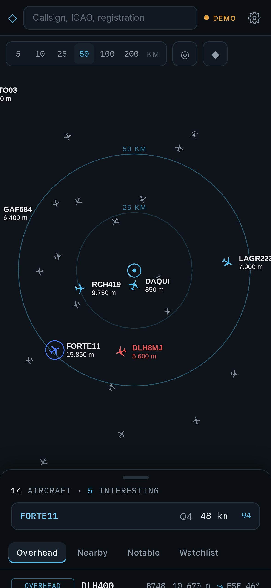

<div align="center">

# ◇ VectorScope

**A personal live aviation radar for iPhone and iPad.**

Open it and see at once what is flying above you: which aircraft will pass overhead next, where to look, and which of them are worth a second glance.

<h3><a href="https://michaeldobner.github.io/VectorScope/">michaeldobner.github.io/VectorScope</a></h3>

[**▶ Open VectorScope**](https://michaeldobner.github.io/VectorScope/) · [Deutsch](README.de.md) · [Documentation](docs/en/README.md) · [Changelog](CHANGELOG.md)

[](https://github.com/michaeldobner/VectorScope/actions/workflows/tests.yml)
[](https://github.com/michaeldobner/VectorScope/actions/workflows/deploy.yml)

&nbsp;&nbsp;
&nbsp;&nbsp;


</div>

## Why VectorScope

Flight trackers show you the whole world, in colour, with ads. VectorScope does the opposite: it answers one question very well. **What is flying over me right now?** It defines "overhead" by the angle at which you would actually see an aircraft in the sky, counts down to the moment it passes, and tells you in which direction to look. A calm, data-dense interface in deep graphite uses colour only where it means something: grey for regular traffic, ice blue for interesting aircraft, cobalt for your watchlist, amber and red for real events. No ads, no account, no tracking.

## Highlights

| | |
|---|---|
| **Overhead now** | What is above you and what will pass over you in the next ten minutes: countdown, miss distance, compass direction and elevation angle |
| **Live radar** | Aircraft around your position with subtle range rings, smooth motion between updates, track history and a projected path for the selected aircraft |
| **Aircraft inspector** | Telemetry, route where published, position relative to you, aircraft photo, links to ADS-B Exchange, adsb.lol and Flightradar24 |
| **Interest score** | Every aircraft is rated from 0 to 100 with transparent reasons: military, role (tanker, AEW&C, ISR, bomber), rare type, age, emergency squawk, watchlist |
| **Notable now** | Military and emergency traffic across Europe, ranked like a terminal |
| **Watchlist** | Callsign prefixes (FORTE, RCH, NATO), type codes (C17, B52), registrations, ICAO addresses, with an alert when a match enters your radius |
| **Colour with meaning** | 90 % of the map stays grey, so the eye finds the interesting aircraft on its own |
| **Made for Apple devices** | iPhone and iPad in portrait and landscape, installs to the Home Screen, respects notch and home indicator, works in Split View |
| **Private by design** | Location and watchlist stay on your device. Queries use coordinates rounded to about 1 km |
| **Metric and German number format** | 10.670 m, 889 km/h, ±0,0 m/s. Feet and knots with one tap |

## How to use

1. Open VectorScope and allow access to your location, or set a location in **Settings**.
2. Pick a radius: 5, 10, 25, 50, 100 or 200 km.
3. Look at **Overhead**: the list starts with what is above you now, followed by what is about to arrive.
4. Tap an aircraft for the inspector. "Look S at 58° elevation" means: face south and look about two thirds of the way up.
5. Add callsigns or types you care about to the **Watchlist**.

Full guide: [User guide](docs/en/user-guide.md).

## Install on iPhone or iPad

1. Open **https://michaeldobner.github.io/VectorScope/** in **Safari**.
2. Tap **Share**, then **Add to Home Screen**.
3. Open VectorScope from the Home Screen and set your location there. Safari and the installed app keep separate storage.
4. **Live data:** browsers may not read adsb.lol directly. Set up the free proxy once (three minutes, [deploy button and one-tap link](docs/en/deployment.md#cors-proxy-on-vercel)). Until then, **Demo** shows simulated traffic.

## Documentation

| Document | Contents |
|---|---|
| [User guide](docs/en/user-guide.md) | Views, controls, watchlist, settings, units, alerts |
| [Calculations](docs/en/calculations.md) | Overhead definition, elevation angle, closest point of approach, interest score |
| [Data sources](docs/en/data-sources.md) | adsb.lol, OpenFreeMap, planespotters.net, what ADS-B delivers and what it does not |
| [Design](docs/en/design.md) | Design brief, colour tokens, typography, map style, layouts |
| [Architecture](docs/en/architecture.md) | Modules, data flow, state, rendering |
| [Development](docs/en/development.md) | Local setup, tests, screenshots, conventions |
| [Deployment](docs/en/deployment.md) | GitHub Pages, CORS proxy on Vercel, troubleshooting |
| [Privacy and legal](docs/en/privacy-and-legal.md) | Location handling, licences, attribution, legal notes |

## Quick start for developers

```bash
npm install
npm run dev        # local server at http://localhost:5173/
npm test           # unit tests for geometry and overhead logic
npm run build      # production build into dist/
```

`?demo` shows synthetic traffic, `?lat=50.11&lon=8.68` fixes the location. Every push to `main` is tested and deployed to GitHub Pages.

## Folder structure

```
VectorScope/
├─ index.html              entry page, iOS web app meta tags
├─ public/
│  ├─ manifest.webmanifest install as an app
│  ├─ sw.js                offline app shell
│  └─ icons/               app icons
├─ src/
│  ├─ main.tsx             start, fonts, service worker
│  ├─ App.tsx              layouts, top bar, search, bottom sheet, alerts
│  ├─ styles.css           design tokens and all layouts
│  ├─ geo/                 distance, bearing, elevation, closest approach (tested)
│  ├─ data/                adsb.lol client, demo traffic, catalogue, interest score
│  ├─ state/               settings, live traffic store, watchlist matching
│  ├─ map/                 MapLibre view, basemap style, aircraft glyphs
│  ├─ lib/                 number and unit formatting
│  └─ ui/                  inspector, lists, settings, layout hooks, tokens
├─ proxy/                  optional CORS proxy for Vercel
├─ docs/                   documentation (en, de, images)
└─ .github/workflows/      tests and GitHub Pages deployment
```

## Data and credits

Traffic data © [adsb.lol](https://adsb.lol) contributors, licensed under ODbL 1.0. Map © [OpenFreeMap](https://openfreemap.org), © OpenMapTiles, © OpenStreetMap contributors. Aircraft photos © the photographers at [planespotters.net](https://www.planespotters.net). VectorScope is a personal, non-commercial project and is not affiliated with any of these services.

## Version

Current version: **0.2.2**. See the [changelog](CHANGELOG.md).

Created by Michael Dobner. Licensed under the [MIT licence](LICENSE).
