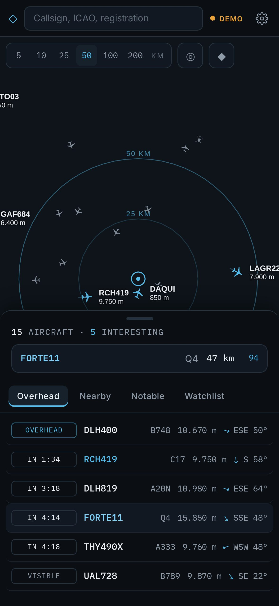
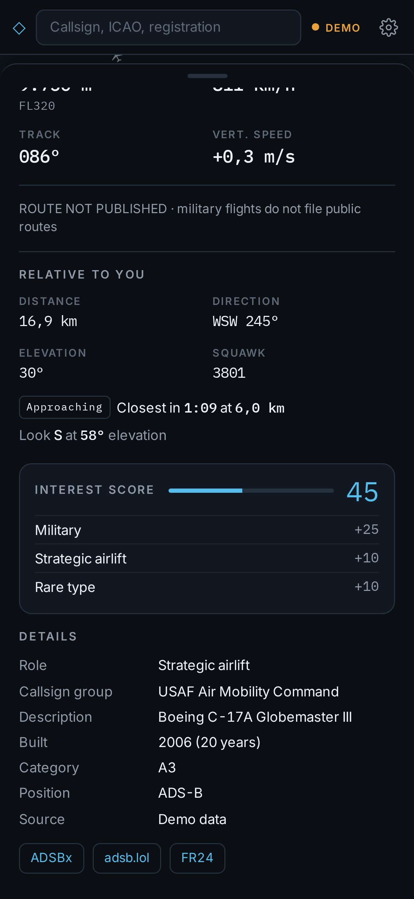

<div align="center">

# ◇ VectorScope Air

**Ein persönliches Live-Luftlagebild für iPhone und iPad.** Modul AIR der [VectorScope-Sammlung](../README.de.md).

Öffnen und sofort sehen, was über dir fliegt: welches Flugzeug als nächstes über dich hinwegzieht, wohin du schauen musst und welche Maschinen einen zweiten Blick wert sind.

<h3><a href="https://michaeldobner.github.io/VectorScope/air/">michaeldobner.github.io/VectorScope/air</a></h3>

[**▶ VectorScope Air öffnen**](https://michaeldobner.github.io/VectorScope/air/) · [English](README.md) · [Dokumentation](docs/de/README.md) · [Changelog](CHANGELOG.de.md)

[](https://github.com/michaeldobner/VectorScope/actions/workflows/tests.yml)
[](https://github.com/michaeldobner/VectorScope/actions/workflows/deploy.yml)

&nbsp;&nbsp;
&nbsp;&nbsp;


</div>

## Warum VectorScope

Flugtracker zeigen die ganze Welt, bunt und mit Werbung. VectorScope macht das Gegenteil und beantwortet eine Frage sehr gut: **Was fliegt gerade über mir?** Die App definiert „über mir“ über den Winkel, unter dem du ein Flugzeug tatsächlich am Himmel sehen würdest, zählt bis zum Überflug herunter und sagt dir, in welche Richtung du schauen musst. Eine ruhige, informationsdichte Oberfläche in tiefem Graphit setzt Farbe nur dort ein, wo sie etwas bedeutet: Grau für normalen Verkehr, Ice Blue für interessante Flugzeuge, Kobalt für deine Watchlist, Amber und Rot für echte Ereignisse. Keine Werbung, kein Konto, kein Tracking.

## Highlights

| | |
|---|---|
| **Overhead jetzt** | Was über dir ist und was in den nächsten zehn Minuten über dich hinwegfliegt: Countdown, Vorbeiflug-Abstand, Himmelsrichtung und Elevationswinkel |
| **Live-Radar** | Flugzeuge rund um deinen Standort mit dezenten Distanzringen, flüssiger Bewegung zwischen den Aktualisierungen, Flugspur und vorausberechnetem Kurs für das ausgewählte Flugzeug |
| **Aircraft Inspector** | Telemetrie, Route soweit veröffentlicht, Position relativ zu dir, Foto des Flugzeugs, Links zu ADS-B Exchange, adsb.lol und Flightradar24 |
| **Interest Score** | Jedes Flugzeug erhält einen Wert von 0 bis 100 mit nachvollziehbaren Gründen: Militär, Rolle (Tanker, AEW&C, ISR, Bomber), seltener Typ, Alter, Notfall-Squawk, Watchlist |
| **Notable now** | Militär- und Notfallverkehr in ganz Europa, gerankt wie in einem Terminal |
| **Watchlist** | Callsign-Präfixe (FORTE, RCH, NATO), Typcodes (C17, B52), Kennzeichen und ICAO-Adressen, mit Hinweis, sobald ein Treffer in deinen Radius kommt |
| **Farbe mit Bedeutung** | 90 % der Karte bleiben grau, damit das Auge die interessanten Flugzeuge von selbst findet |
| **Für Apple-Geräte gemacht** | iPhone und iPad hoch und quer, Installation auf dem Home-Bildschirm, berücksichtigt Notch und Home-Indikator, funktioniert in Split View |
| **Datenschutz von Anfang an** | Standort und Watchlist bleiben auf deinem Gerät. Abfragen nutzen auf etwa 1 km gerundete Koordinaten |
| **Metrisch und deutsches Zahlenformat** | 10.670 m, 889 km/h, ±0,0 m/s. Fuß und Knoten mit einem Tipp |

## Bedienung

1. VectorScope öffnen und den Standortzugriff erlauben oder in den **Einstellungen** einen Standort festlegen.
2. Radius wählen: 5, 10, 25, 50, 100 oder 200 km.
3. Auf **Overhead** schauen: Die Liste beginnt mit dem, was gerade über dir ist, gefolgt von dem, was gleich kommt.
4. Ein Flugzeug antippen öffnet den Inspector. „Look S at 58° elevation“ bedeutet: nach Süden drehen und etwa zwei Drittel nach oben schauen.
5. Callsigns oder Typen, die dich interessieren, zur **Watchlist** hinzufügen.

Ausführliche Anleitung: [Bedienung](docs/de/bedienung.md).

## Installation auf iPhone oder iPad

1. **https://michaeldobner.github.io/VectorScope/air/** in **Safari** öffnen.
2. **Teilen** antippen, dann **Zum Home-Bildschirm**.
3. VectorScope Air vom Home-Bildschirm aus öffnen und dort den Standort festlegen. Safari und die installierte App haben getrennte Speicher.
4. **Live-Daten** kommen über den [Proxy des Projekts](../docs/de/deployment.md#cors-proxy-auf-vercel), der fest eingebaut ist. Es muss nichts eingerichtet werden. **Demo** in den Einstellungen zeigt simulierten Verkehr.

## Dokumentation

| Dokument | Inhalt |
|---|---|
| [Bedienung](docs/de/bedienung.md) | Ansichten, Steuerung, Watchlist, Einstellungen, Einheiten, Hinweise |
| [Berechnungen](docs/de/berechnungen.md) | Definition von „Overhead“, Elevationswinkel, Closest Point of Approach, Interest Score |
| [Datenquellen](docs/de/datenquellen.md) | adsb.lol, OpenFreeMap, planespotters.net, was ADS-B liefert und was nicht |
| [Design](docs/de/design.md) | Design-Briefing, Farb-Tokens, Typografie, Kartenstil, Layouts |
| [Architektur](docs/de/architektur.md) | Module, Datenfluss, Zustand, Darstellung |
| [Entwicklung](docs/de/entwicklung.md) | Lokale Umgebung, Tests, Screenshots, Konventionen |
| [Deployment](../docs/de/deployment.md) | GitHub Pages, CORS-Proxy auf Vercel, Fehlerbehebung (für alle Module) |
| [Datenschutz und Recht](docs/de/datenschutz-und-recht.md) | Umgang mit dem Standort, Lizenzen, Quellenangaben, rechtliche Hinweise |

## Schnellstart für Entwickler

```bash
npm install        # im Hauptordner des Repositorys
npm run dev        # dieses Modul unter http://localhost:5173/
npm test           # Unit-Tests aller Module und Prüfungen des Repositorys
npm run build      # Startseite und alle Module nach dist/, dieses Modul nach dist/air/
```

`?demo` zeigt simulierten Verkehr, `?lat=50.11&lon=8.68` legt den Standort fest. Jeder Push auf `main` wird getestet und auf GitHub Pages veröffentlicht. Details: [Entwicklung](docs/de/entwicklung.md).

## Ordnerstruktur

```
air/
├─ index.html              Einstiegsseite, iOS-Web-App-Angaben, Startdiagnose
├─ vite.config.ts          Build nach dist/air/, Version aus modules.json
├─ public/
│  ├─ manifest.webmanifest Installation als App
│  ├─ sw.js                Offline-App-Hülle, Speicher vectorscope-air-v1
│  └─ icons/               App-Icons
├─ src/
│  ├─ main.tsx             Start, Schriften, gemeinsame Tokens, Service Worker
│  ├─ App.tsx              Layouts, Kopfleiste, Suche, Bottom Sheet, Hinweise
│  ├─ styles.css           Layouts und Komponenten (Farben aus shared/tokens.css)
│  ├─ geo/                 Distanz, Peilung, Elevation, Closest Approach (getestet)
│  ├─ data/                adsb.lol-Client, Routen- und Flugzeugabfrage, Demo-Verkehr, Katalog, Interest Score
│  ├─ state/               Einstellungen, Live-Verkehr, Watchlist-Abgleich
│  ├─ map/                 MapLibre-Ansicht, Kartenstil, Flugzeugsymbole
│  ├─ lib/                 Zahlen- und Einheitenformat
│  └─ ui/                  Inspector, Listen, Einstellungen, Layout-Hooks, Farbschemata
└─ docs/                   Modul-Dokumentation (en, de, Bilder)
```

Die Struktur des Repositorys rund um das Modul (Startseite, `shared/`, Proxy, Workflows) beschreibt die [Architektur der Sammlung](../docs/de/architektur.md).

## Daten und Quellen

Verkehrsdaten © Mitwirkende von [adsb.lol](https://adsb.lol), lizenziert unter ODbL 1.0. Karte © [OpenFreeMap](https://openfreemap.org), © OpenMapTiles, © OpenStreetMap-Mitwirkende. Flugzeugfotos © die Fotografinnen und Fotografen von [planespotters.net](https://www.planespotters.net). VectorScope ist ein persönliches, nichtkommerzielles Projekt und steht in keiner Verbindung zu diesen Diensten.

## Version

Aktuelle Version: **0.4.0**. Siehe [Changelog](CHANGELOG.de.md).

Erstellt von Michael Dobner. Lizenziert unter der [MIT-Lizenz](../LICENSE).
