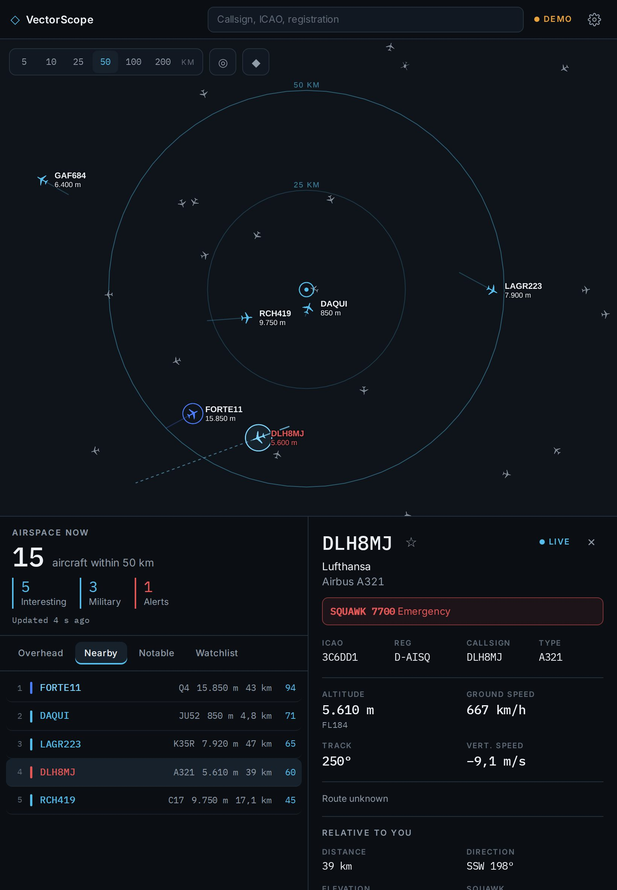
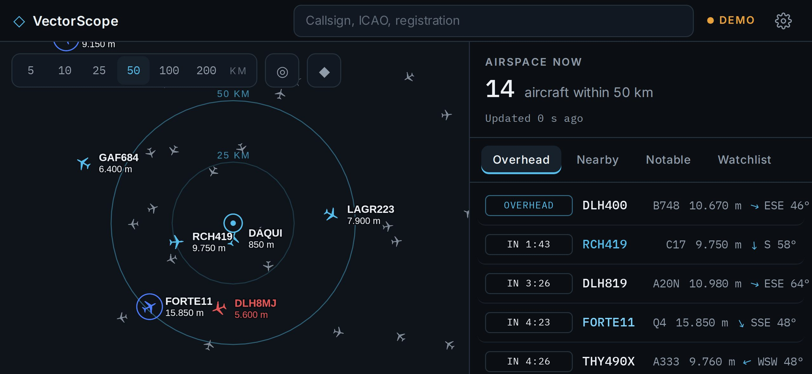
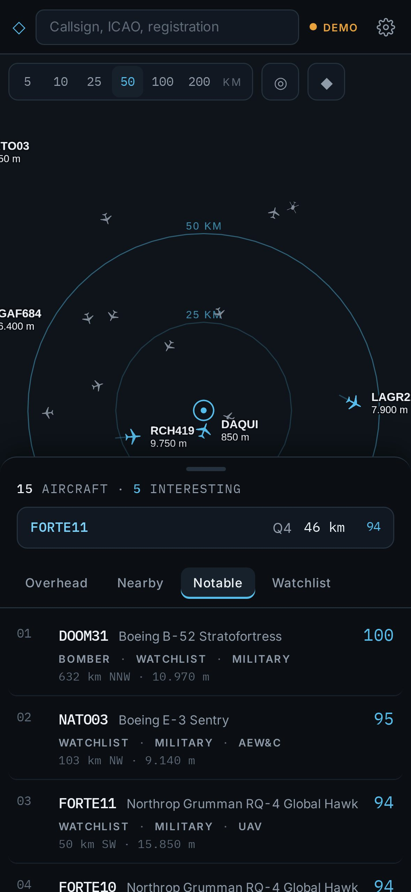
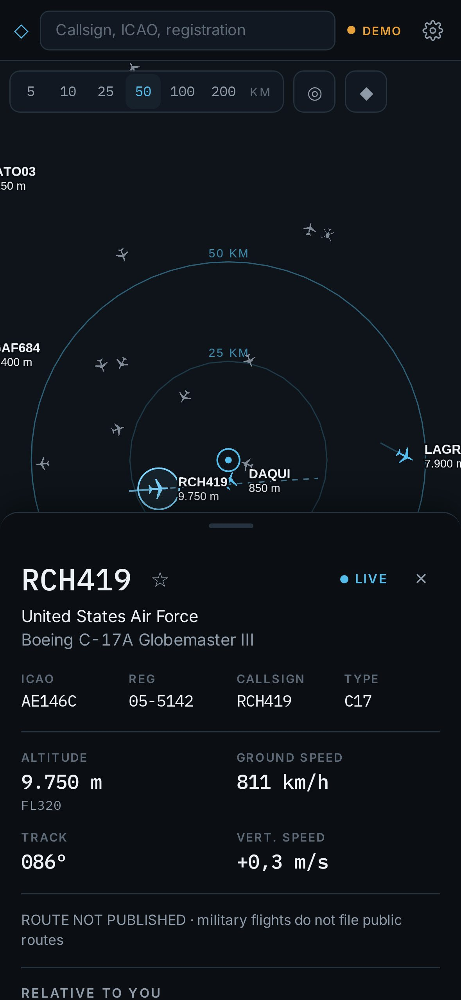
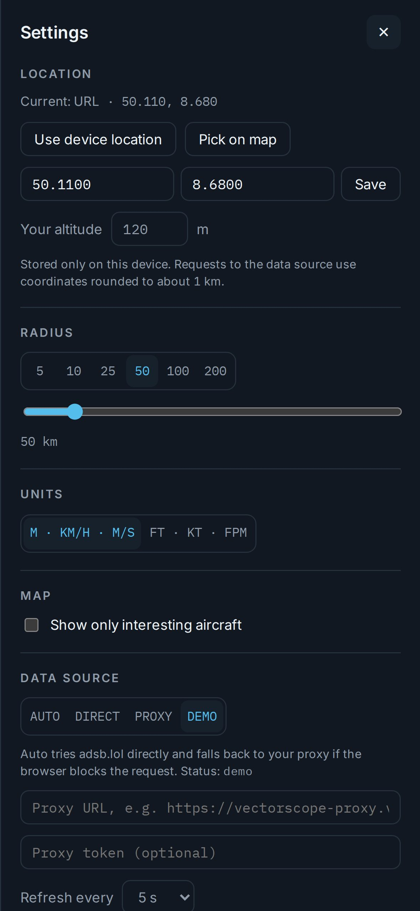

# Bedienung

[English version](../en/user-guide.md) · [Übersicht](README.md)

## Erster Start

1. VectorScope öffnen. Der Browser fragt nach deinem Standort. Erlauben oder ablehnen und später in den **Einstellungen** einen Standort festlegen.
2. Solange kein Standort bekannt ist, zeigt VectorScope den Luftraum um Frankfurt.
3. Die Karte rahmt deinen Radius automatisch ein. Der Status in der Kopfleiste zeigt **LIVE** (Daten aktuell), **CONNECTING**, **OFFLINE** oder **DEMO**.

Auf iPhone und iPad VectorScope auf dem Home-Bildschirm installieren (Safari, Teilen, Zum Home-Bildschirm) und den Standort in der installierten App festlegen. Safari und die installierte App haben getrennte Speicher.

## Bildschirmaufbau

| Gerät | Layout |
|---|---|
| iPhone hochkant | Karte im Vollbild. Unten ein Panel mit drei Höhen: Vorschau mit Anzahl der Flugzeuge und dem interessantesten, halbe Höhe mit den Listen, volle Höhe. Am Griff ziehen oder antippen |
| iPhone quer | Karte links, rechts ein Panel mit Airspace now und den Listen. Der Inspector ersetzt die Listen |
| iPad hochkant | Karte oben. Darunter links die Listen, rechts der Inspector oder Notable now |
| iPad quer | Karte mit Inspector oder Overhead rechts. Darunter eine Leiste mit Notable now, Interesting nearby und Watchlist |

Das Layout richtet sich nach dem tatsächlich verfügbaren Platz und passt sich daher auch in Split View und Slide Over an.

&nbsp;

## Kartensteuerung

| Element | Funktion |
|---|---|
| **5 · 10 · 25 · 50 · 100 · 200 KM** | Radius. Die Karte rahmt ihn ein, die Listen zählen nur Flugzeuge innerhalb |
| **◎** | Karte wieder auf deinen Standort und den Radius ausrichten |
| **◆** | Nur interessante Flugzeuge zeigen. Normaler Verkehr wird ausgeblendet |
| Flugzeug antippen | Öffnet den Inspector. Das Flugzeug erhält einen Lichtkranz, seine Flugspur und eine gestrichelte Vorausberechnung für drei Minuten |
| Leere Karte antippen | Schließt den Inspector |
| Zwei Finger, Ziehen | Zoomen und verschieben. Die Karte dreht sich nicht, Norden ist immer oben. Zeigt die Karte ein Gebiet fern deines Standorts, lädt AIR auch den Verkehr dort, bis etwa 460 km um die Kartenmitte (seit AIR 0.4.0). Listen und Hinweise bleiben bei deinem Standort |

## Die Karte lesen

| Symbol | Bedeutung |
|---|---|
| Kleines graues Flugzeug | Normaler Verkehr. Beschriftungen erscheinen erst beim Hineinzoomen |
| Ice Blue mit Beschriftung | Interessantes Flugzeug (Interest Score ab 25), mit kurzer Spur |
| Kobaltblauer Ring | Treffer der Watchlist |
| Amber | Ereignis, zum Beispiel Squawk 7600 (Funkausfall) |
| Rot mit roter Beschriftung | Notfall, Squawk 7700 oder 7500 |
| Helles Eisblau mit Lichtkranz | Ausgewähltes Flugzeug |
| ◎ mit feinen Ringen | Dein Standort, innerer Ring bei halbem Radius |
| Graue Kreise mit ICAO-Code | Flughäfen, ab Zoomstufe 9 mit Pistenumrissen |

Die Beschriftung zeigt Callsign und Höhe. Die Höhe ist barometrisch, standardmäßig in Metern.

## Airspace now

Die Zusammenfassung oben im Panel zeigt, wie viele Flugzeuge in deinem Radius sind, wie viele davon interessant, wie viele militärisch und wie viele einen Hinweis auslösen, dazu den Zeitpunkt der letzten Aktualisierung.

## Overhead

Die Liste beantwortet „Was ist über mir?“. Sie ist so sortiert:

| Kennzeichnung | Bedeutung |
|---|---|
| **ZENITH** | Das Flugzeug steht mindestens 70° über dem Horizont, praktisch senkrecht über dir |
| **OVERHEAD** | Mindestens 45° über dem Horizont |
| **IN 2:40** | Es zieht innerhalb von zehn Minuten an dir vorbei und steht dann mindestens 45° hoch. Der Countdown läuft live |
| **VISIBLE** | Mindestens 15° hoch und höchstens 30 km entfernt, bei gutem Wetter mit bloßem Auge sichtbar |

Jede Zeile zeigt Typ, Höhe und wohin du schauen musst: einen Pfeil, die Himmelsrichtung und den Elevationswinkel. Bei Flugzeugen im Anflug ist es die Richtung am nächsten Punkt. Wie das berechnet wird: [Berechnungen](berechnungen.md).

## Nearby

Interessante Flugzeuge innerhalb deines Radius, nach Interest Score sortiert: Rang, Farbbalken, Callsign, Typ, Höhe, Entfernung und Score.

## Notable now

Militär- und Notfallverkehr im Umkreis von 2.500 km, nach Interest Score gerankt und jede Minute aktualisiert. Jeder Eintrag zeigt Score, Typ, die drei stärksten Gründe sowie Entfernung und Richtung von dir aus. Ein Tipp öffnet den Inspector, auch wenn das Flugzeug weit entfernt ist.

## Aircraft Inspector

| Bereich | Inhalt |
|---|---|
| Kopf | Callsign, Stern für die Watchlist, LIVE oder Alter der letzten Position, Betreiber, Typ |
| Banner | Nur bei besonderen Squawks: 7700, 7600, 7500, 7400 |
| Foto | Von planespotters.net mit Namen der Fotografin oder des Fotografen. Antippen öffnet das Original |
| Identität | ICAO-Adresse, Kennzeichen, Callsign, ICAO-Typcode |
| Telemetrie | Höhe mit Flugfläche, Geschwindigkeit über Grund, Kurs, Steig- oder Sinkrate |
| Route | Start und Ziel, falls eine plausible Route bekannt ist. Militärflüge zeigen „Route not published“ |
| Relative to you | Entfernung, Himmelsrichtung, Elevationswinkel, Squawk, dazu der nächste Punkt: Zeit, Abstand und Blickrichtung |
| Interest Score | Wert von 0 bis 100 und jeder Grund mit seinen Punkten |
| Details | Rolle, Callsign-Gruppe, Beschreibung, Baujahr, Kategorie, Herkunft der Position, Datenquelle |
| Links | Flugzeug bei ADS-B Exchange, adsb.lol oder Flightradar24 öffnen |

Der Stern fügt das Flugzeug der Watchlist hinzu (über das Kennzeichen, sonst über die ICAO-Adresse) oder entfernt es.

&nbsp;

## Watchlist

Die Watchlist kennt vier Arten von Regeln:

| Art | Trifft zu auf | Beispiel |
|---|---|---|
| Callsign prefix | Jedes Callsign, das mit dem Wert beginnt | `FORTE`, `RCH`, `NATO`, `GAF` |
| Type code | ICAO-Typcode, exakt | `C17`, `B52`, `A400`, `E3TF`, `A124` |
| Registration | Exakt, Leerzeichen werden ignoriert | `D-ABYA`, `05-5142` |
| ICAO hex | Exakt, sechs Zeichen | `AE146C` |

Treffer erscheinen oben in der Watchlist unter **In range now**, erhalten auf der Karte einen kobaltblauen Ring und 30 zusätzliche Punkte im Interest Score. Kommt ein Treffer in deinen Radius, erscheint oben ein Hinweis. FORTE, NATO, B52 und A124 sind voreingestellt und lassen sich entfernen.

## Suche

Das Suchfeld in der Kopfleiste nimmt Callsign, Kennzeichen, ICAO-Adresse oder Typcode an. VectorScope sucht zuerst in den bereits geladenen Flugzeugen. Ohne Treffer fragt es weltweit bei adsb.lol an und zeigt eine Ergebnisliste.

## Einstellungen

Öffnen über das Zahnrad in der Kopfleiste.

| Bereich | Möglichkeiten |
|---|---|
| Location | Gerätestandort verwenden, auf der Karte wählen, Koordinaten eingeben, eigene Höhe über dem Meer (für den Elevationswinkel) |
| Radius | Schnellwahl oder jeder Wert von 2 bis 400 km |
| Units | m · km/h · m/s oder ft · kt · fpm. Zahlen immer im deutschen Format |
| Map | Nur interessante Flugzeuge zeigen |
| Data source | Auto, Direct, Proxy, Demo. Proxy-Adresse, optionales Token, Aktualisierung alle 3, 5, 10 oder 20 Sekunden |

## Hinweise

VectorScope zeigt oben einen Hinweis, wenn

* ein Flugzeug mit Notfall- oder Ereignis-Squawk in deinen Radius kommt oder
* ein Treffer der Watchlist in deinen Radius kommt.

Ein Tipp auf den Hinweis öffnet das Flugzeug. Hinweise verschwinden nach acht Sekunden. Sie funktionieren nur bei geöffneter App, Push-Benachrichtigungen im Hintergrund sind geplant.

## Demo-Modus

Ohne Datenzugang oder zum Ausprobieren in den Einstellungen oder im Fehlerbanner **Demo** wählen. VectorScope simuliert dann rund 50 Flugzeuge um deinen Standort, darunter eine RQ-4 Global Hawk, eine C-17, eine KC-135, eine NATO E-3, einen A400M, eine Ju 52, einen Rettungshubschrauber und einen A321 mit Squawk 7700. Der Status zeigt **DEMO**.
