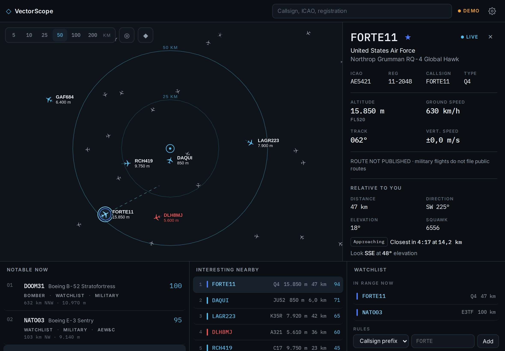

# VectorScope · Documentation

[Deutsche Version](../de/README.md) · [Back to the project](../../README.md)

This documentation describes VectorScope completely: how to use it, how it calculates what is overhead, where its data comes from, how it looks, how it is built and how to develop and publish it.

| Document | Contents | Audience |
|---|---|---|
| [User guide](user-guide.md) | Views, controls, radius, overhead, inspector, watchlist, search, settings, alerts | Everyone |
| [Calculations](calculations.md) | Distance, bearing, elevation angle, overhead classes, closest point of approach, interest score | Everyone, development |
| [Data sources](data-sources.md) | adsb.lol endpoints and fields, route lookup, photos, basemap, what ADS-B provides and what it does not | Development, operations |
| [Design](design.md) | Design brief, colour tokens, aircraft colours, typography, map style, layouts, motion | Design, development |
| [Architecture](architecture.md) | Modules, data flow from request to map, state stores, rendering, service worker | Development |
| [Development](development.md) | Local setup, tests, demo mode, screenshots, conventions, extending the catalogue | Development |
| [Deployment](deployment.md) | GitHub Pages, CORS proxy on Vercel, updates on devices, troubleshooting | Operations |
| [Privacy and legal](privacy-and-legal.md) | Location handling, storage, licences, attribution, legal notes | Everyone |

## VectorScope at a glance

| | |
|---|---|
| Purpose | Personal live aviation radar: what is flying above you, what will pass over you next, what is worth a look |
| Views | Radar, Overhead, Nearby, Notable now, Watchlist, Aircraft inspector, Settings |
| Platform | Progressive web app for iPhone and iPad, runs in every modern browser |
| Layouts | iPhone portrait and landscape, iPad portrait and landscape, Split View |
| Language | English interface, German number format, metric units (feet and knots optional) |
| Data | adsb.lol (ODbL), OpenFreeMap, planespotters.net |
| Technology | React 18, TypeScript, Vite, MapLibre GL, Vitest |
| Hosting | GitHub Pages, optional proxy on Vercel |
| Privacy | No account, no server-side storage, location only on the device |
| Address | https://michaeldobner.github.io/VectorScope/ |
| Version | 0.2.2 |

&nbsp;
&nbsp;

