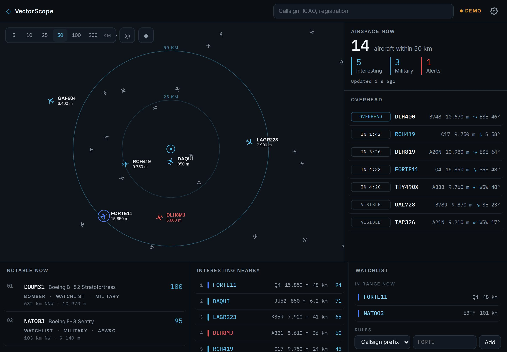

# Design

[Deutsche Version](../de/design.md) · [Overview](README.md)

## Design brief

> Serious, calm, data-dense aviation intelligence interface.
> Deep graphite surfaces, restrained ice-blue accents, precise typography, subtle geospatial visualization and colour used exclusively to communicate meaning.
> No gaming aesthetics. No cyberpunk. No military cosplay. No unnecessary decoration.
> It should feel like a professional intelligence instrument that happens to be beautiful.

Visual DNA: **`#0E0E10` + `#F5F5F7` + `#55BDEB`**: neutral graphite like Apple Maps, white text and aircraft, ice blue as the only accent. Chosen on 2026-10-04 after comparing three themes on the live map; `?theme=ice` and `?theme=night` remain available for comparison.

VectorScope sits between three worlds: Apple for calm and precision, professional intelligence terminals for information density, and modern aviation displays for the functional language. It deliberately avoids green military radar, cyberpunk neon, a black hacker look, colourful flight tracker icons and heavy glass effects. Dark first: the map and the signals work better on a dark surface and the product reads as a situation display.

*Design target that defined the direction. The implementation follows it, with the corrections listed under [Decisions](#decisions).*

## Colour tokens

| Role | Name | Hex |
|---|---|---|
| Main background | Graphite | `#0E0E10` |
| Panels | Graphite Panel | `#1C1C1E` |
| Raised panels | Graphite Raised | `#2C2C2E` |
| Lines and borders | Graphite Line | `#38383A` |
| Primary text | Off White | `#F5F5F7` |
| Secondary text | Grey | `#A1A1A6` |
| Tertiary text | | `#6E6E73` |
| Primary accent | Ice Blue | `#55BDEB` |
| Selected, active | Bright Ice | `#7DD3FC` |
| Watchlist | Cobalt | `#4C7DFF` |
| Warning, event | Amber | `#FF9F0A` |
| Critical, emergency | Signal Red | `#FF453A` |

Tokens live in `src/styles.css` as CSS custom properties and in `src/ui/tokens.ts` for the map. Blue is used only for information and interaction, never as decoration.

## Information levels

1. **White:** what you need to know now, for example the callsign.
2. **Grey:** metadata, for example type and operator.
3. **Blue:** interaction and relevance, for example the score.
4. **Amber and red:** real deviations only, for example squawk 7700.

## Aircraft

| Meaning | Colour | Second channel |
|---|---|---|
| Regular | `#E5E5EA` | Small icon, label only from zoom 9.5 |
| Interesting | Ice Blue | Larger icon, label with altitude, trail of the last five minutes |
| Watchlist | Cobalt | Thin ring around the icon |
| Event | Amber | Label |
| Emergency | Signal Red | Red label |
| Selected | Bright Ice | Halo, solid track for five minutes, dotted before that, dashed projection for three minutes |

Every meaning uses colour **and** a second channel (size, ring, label), so it stays readable in sunlight and with colour vision deficiency. The aircraft glyph is drawn on a canvas and registered as an SDF image, so MapLibre can tint it per aircraft. Helicopters (emitter category A7) get their own glyph.

## Typography

| Use | Font |
|---|---|
| Interface, headings, text | Inter 400, 500, 600 |
| Callsigns, codes, telemetry, counts | IBM Plex Mono 400, 500 |
| Map labels | Noto Sans (from the map's font server) |

Tabular figures everywhere, so numbers do not jitter when they update. Section titles are small capitals with wide letter spacing. Both fonts are bundled with the app; there are no requests to Google Fonts.

## Map

An air navigation display, not a road map.

| Layer | Style |
|---|---|
| Land | `#1D1D20` |
| Water | `#13202C`, slightly bluish |
| Built-up areas | Barely visible from zoom 8 |
| Country borders | Fine line `#55555A` |
| State borders | Dashed, very faint, from zoom 5 |
| Motorways | From zoom 9 only |
| Airports | Ring with ICAO code from zoom 6 (international) or 8.5 (all), aerodrome area and runways from zoom 8 to 9 |
| Country names | Up to zoom 6, small capitals, dark |
| City names | Muted, towns from zoom 9 |
| Range rings | Ice blue, outer ring 45 % opacity, inner ring at half the radius 22 %, label "50 KM" |
| Your position | `◎` ring with dot in Ice Blue |

The style is defined in `src/map/style.ts`. The map does not rotate or tilt.

## Layouts

| | Portrait | Landscape |
|---|---|---|
| **iPhone** | Full screen map, bottom sheet with three heights (peek, half, full), inspector inside the sheet | Map plus side panel, inspector replaces the lists |
| **iPad** | Map on top (56 %), below the lists and the inspector side by side | Map, right column (inspector or Airspace now and Overhead), strip with Notable now, Interesting nearby and Watchlist |

The layout is chosen from the available width and height (`src/ui/useLayout.ts`), not from the device type. Safe areas for notch, Dynamic Island and home indicator are respected through `env(safe-area-inset-*)`. Touch targets are at least 30 to 36 points high.

## Motion

* Aircraft glide between updates, redrawn ten times per second.
* The bottom sheet moves with a soft ease (280 ms), follows the finger while dragging.
* Notices slide in briefly and disappear after eight seconds.
* The LIVE dot pulses slowly. Nothing else blinks.

## Decisions

Corrections to the design target, made deliberately:

| Target | Implementation | Reason |
|---|---|---|
| Regular aircraft `#AAB4BE` | `#7F8A96` | Too close to Ice Blue in brightness, especially on small icons and in sunlight |
| Many orange aircraft on the map | Amber only for real events | Amber loses its meaning if a third of the sky is orange |
| Map shows half of Germany at 50 km | Map frames the chosen radius | The core question is what is above you |
| Mixed German and English labels | English interface, German number format | Aviation language is English |
| Route with departure and arrival times for a C-17 | "Route not published" | Military flights do not publish routes |
| Chips "Many watchers", "Unusual route" | Not shown | No data source provides them |
| Trending panel | Notable now | No public API provides "most tracked" lists |
