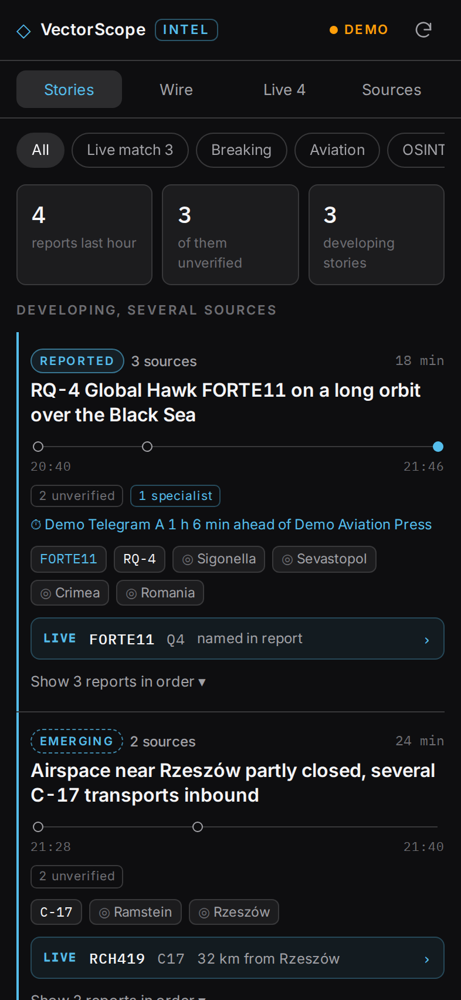
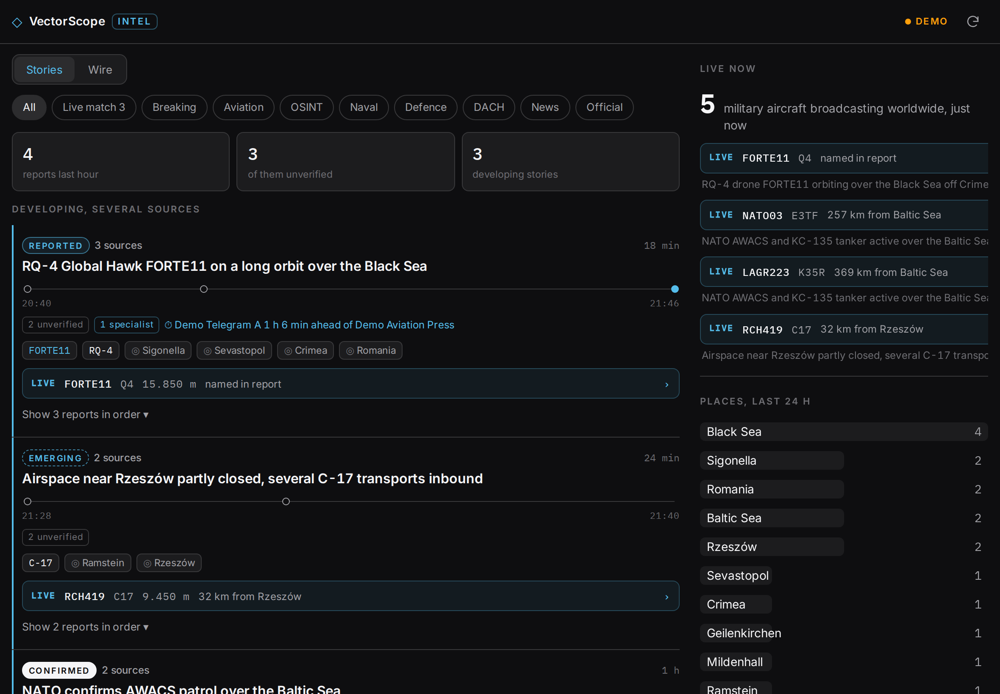

<div align="center">

# ◇ VectorScope Intel

**Verified OSINT and defence news, matched to aircraft in the air right now.** Module INTEL of the [VectorScope collection](../README.md).

<h3><a href="https://michaeldobner.github.io/VectorScope/intel/">michaeldobner.github.io/VectorScope/intel</a></h3>

[**▶ Open VectorScope Intel**](https://michaeldobner.github.io/VectorScope/intel/) · [Deutsch](README.de.md) · [Documentation](docs/en/README.md) · [Changelog](CHANGELOG.md)

&nbsp;&nbsp;


</div>

## Why INTEL

Fast Telegram newsrooms report first, specialist media explain, leading media confirm. Flight data shows who is flying right now. INTEL brings all of it together: it groups reports of the same event from different sources into **stories**, shows how far each story is confirmed and how far the fast channels were ahead. In addition it reads a short list of verified sources, recognises callsigns, aircraft types and places in every post and checks them against the military aircraft broadcasting at this moment. When an article about an RQ-4 over the Black Sea appears while FORTE11 is orbiting there, INTEL shows it, and one tap opens the aircraft in AIR.

## Highlights

| | |
|---|---|
| **Stories** | Reports from different sources about the same event become one card with status Signal, Emerging, Reported or Confirmed, a time axis of all reports and the lead time of the first unverified report |
| **24 verified sources in four tiers** | Telegram newsrooms (OSINTdefender, RAGE X, War Monitor, Insider Paper, Clash Report), OSINT researchers, specialist media and confirming media (Tagesschau, Deutschlandfunk, DW, BBC, Al Jazeera). Each checked in the test lab |
| **Probe collector** | For one week a collector on GitHub Actions keeps every report every 15 minutes, so nothing scrolls away while the app is closed |
| **Wire** | Every report on its own, newest first, with its tier |
| **Recognition** | Military callsigns (FORTE11, RCH419, NATO03), about 45 aircraft types in several spellings (KC-135, KC135R, Stratotanker), about 100 places in English and German (Ostsee, Black Sea, Rzeszów, Ramstein) |
| **Live match** | Callsign named in the post and airborne now, or type named and an aircraft of that type near the named place. Highlighted in ice blue, one tap opens it in AIR |
| **Places** | Which places were named in the last 24 hours, one tap filters the feed |
| **Source health** | Every source with its status and the age of its newest post |
| **Calm and private** | No images, no tracking, no account. Read state stays on the device |

## How to use

1. Open INTEL. **Stories** shows developing stories with several sources at the top, everything else below. New reports since your last visit carry a blue dot.
2. Tap **Show reports in order** to see how a story came about. **Wire** shows every report on its own.
3. Filter by **Live match**, **Breaking**, **Aviation**, **OSINT**, **Naval**, **Defence**, **DACH**, **News** or **Official**.
4. A blue **LIVE** row means: this aircraft is in the air now and the post names it or its type near its position. Tap it to open the aircraft in AIR.
5. Tap a place to see only reports that name it.

Full guide: [User guide](docs/en/user-guide.md).

## Documentation

| Document | Contents |
|---|---|
| [User guide](docs/en/user-guide.md) | Views, filters, live matches, places, sources |
| [Stories](docs/en/stories.md) | Tiers, status, grouping, lead time |
| [Sources](docs/en/sources.md) | The verified sources, how they were checked, sources that were rejected and why |
| [Probe collector](docs/en/collector.md) | One week of collecting on GitHub Actions |
| [Matching](docs/en/matching.md) | Recognition of callsigns, types and places, rules of the live match |
| [Architecture](docs/en/architecture.md) | Modules, data flow, proxy route, storage |
| [Privacy and legal](docs/en/privacy-and-legal.md) | What is loaded from where, excerpts and links, licences |

## Quick start for developers

```bash
npm install            # in the repository root
npm run dev:intel      # this module at http://localhost:5173/
npm test               # unit tests of all modules and repository checks
```

`?demo` shows synthetic items and aircraft, marked as demo.

## Version

Current version: **0.2.1**. See the [changelog](CHANGELOG.md).

Created by Michael Dobner. Licensed under the [MIT licence](../LICENSE).
